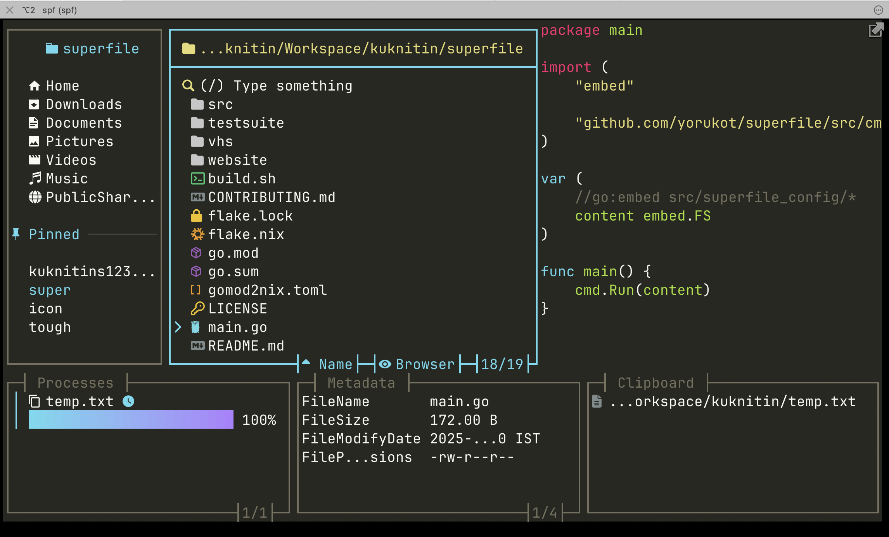
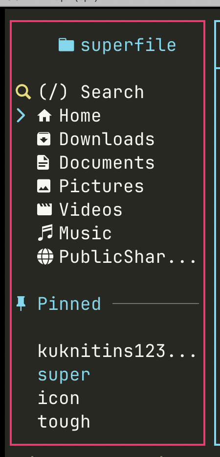
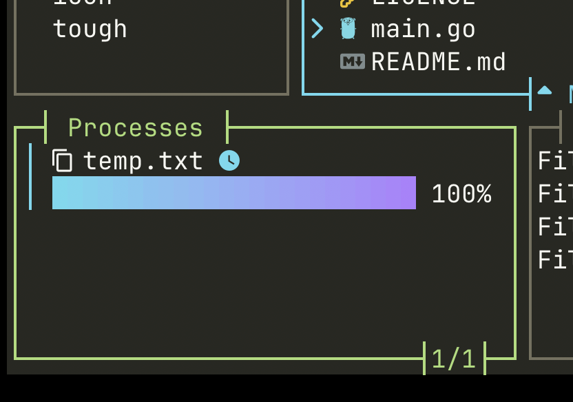
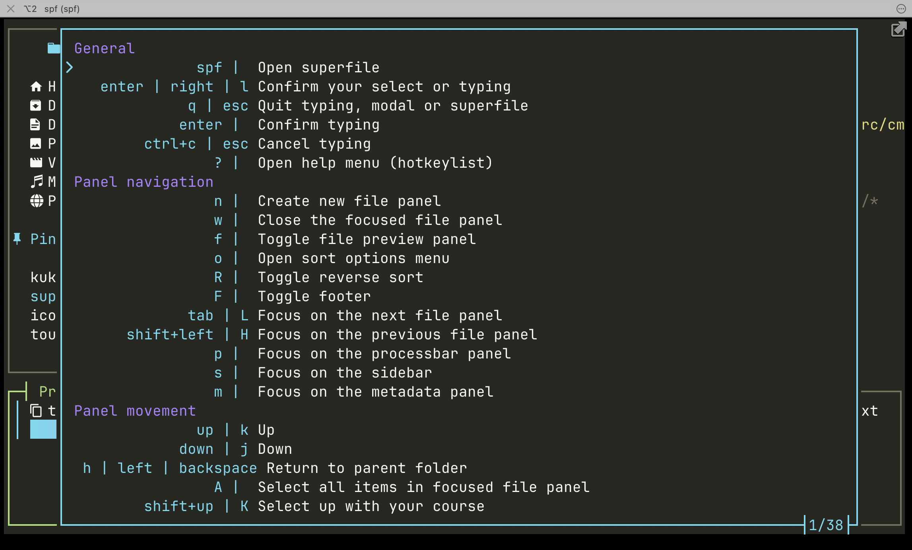
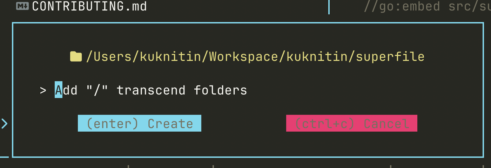
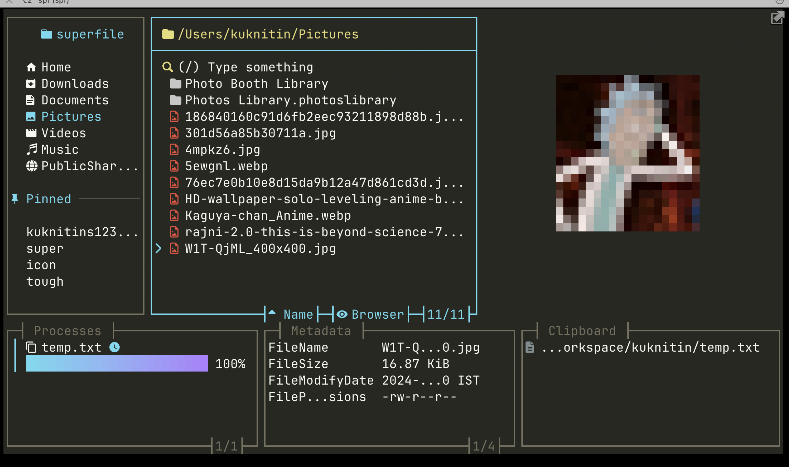
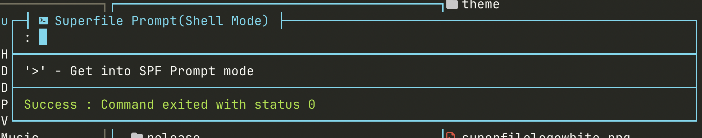
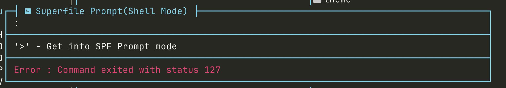

# 為 superfile 貢獻

歡迎來到 **superfile**！這份指南會協助您開始為專案做出貢獻，不論是修復錯誤、開發功能，或只是分享想法都很適合。

有許多方式可以貢獻：

* 回報錯誤
* 修復 issue
* 新增主題
* 建議並實作新功能
* 分享想法或回饋

---

## 🐞 Issues

### 發現錯誤了嗎？

請先確認是否已經有開啟或關閉的 issue 提到相同問題。如果沒有，請開一個新的 issue，並清楚描述問題。

### 想修復某個 issue？

1. Fork 這個 repository
2. 為您要處理的 issue 建立新分支
3. 使用清楚的訊息提交您的變更
4. 開啟 pull request (PR)，並描述問題與您的解法

維護者可能會在合併前要求修改。

---

## 🎨 新增主題

開始前，請先確認您想新增的主題尚未存在。

1. 複製現有主題的 `.toml` 檔作為基礎
2. 依需求自訂內容
3. 透過編輯 `~/.config/superfile/config/config.toml` 來測試
4. 準備好後送出 pull request
5. 為了確保主題看起來一致且功能正常，請在 PR 中附上以下截圖：
- superfile 的完整畫面（包含側邊欄、檔案預覽器、process panel、metadata panel 和 clipboard panel）
    - 請確保檔案預覽器不是空的、process panel 至少有一個 process，且 clipboard 至少有一個項目
- 新增這些個別面板聚焦時的截圖（用來確認邊框聚焦顏色正常）
    - 側邊欄
    - Processbar
- 新增說明選單的截圖（按下 ?）
- 新增建立新檔案時開啟的 popup 截圖（Ctrl+n）
- 新增使用您的主題預覽圖片時的截圖。
- 新增 shell command 成功與失敗時的截圖。

範例：

- superfile 的完整畫面（包含側邊欄、檔案預覽器、process panel、metadata panel 和 clipboard panel）

  - 請確保檔案預覽器不是空的、process panel 至少有一個 process，且 clipboard 至少有一個項目

  

- 新增這些個別面板聚焦時的截圖（用來確認邊框聚焦顏色正常）

  - 側邊欄
  - Processbar

  

  

- 新增說明選單的截圖（按下 `?`）

  

- 新增建立新檔案時開啟的 popup 截圖（Ctrl+n）

  

- 新增使用您的主題預覽圖片時的截圖

  

- 新增 shell command 成功與失敗時的截圖

  

  

---

## 💡 分享想法

有新的想法嗎？太好了！

1. 先確認 Discussions 或 Issues 中是否已有類似想法
2. 到這裡開啟 discussion：[https://github.com/yorukot/superfile/discussions](https://github.com/yorukot/superfile/discussions)
3. 如果您想自行實作，請依照上方 PR 步驟進行

---

## 🧩 不知道從哪裡開始？

請參考 GitHub 官方指南：
[https://docs.github.com/en/get-started/exploring-projects-on-github/contributing-to-a-project](https://docs.github.com/en/get-started/exploring-projects-on-github/contributing-to-a-project)

仍然不確定嗎？開啟 discussion，我們很樂意協助。

---

## ✅ Pull Request 檢查清單

請確認您的 PR 符合以下步驟：

* [ ] 我已執行 `go fmt ./...` 來格式化程式碼
* [ ] 我已執行 `golangci-lint run` 並修正所有回報的問題
* [ ] 我已測試變更並確認其如預期運作
* [ ] 我已檢查 diff，確認沒有提交任何 debug logs 或 TODOs
* [ ] 我已填寫 PR template，包含描述、背景，以及必要時的截圖
- [ ] 我已確認 PR title 符合 [Conventional Commits](https://www.conventionalcommits.org/en/v1.0.0/) 格式

---

## 🙏 感謝您

感謝您為 superfile 做出貢獻！我們珍惜每一個 issue、pull request 和想法。您的幫助讓這個專案對所有人都更好。
