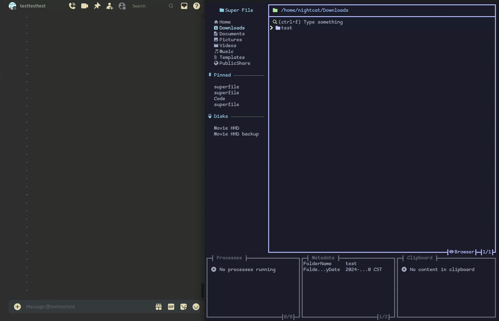
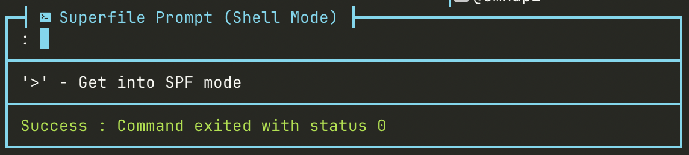
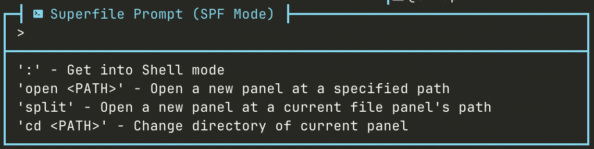

本教學會一步一步教你如何使用 superfile。

:::caution

如果你還沒有安裝 superfile，請[點這裡](/zh-tw/getting-started/installation)。

:::

:::tip

完整快捷鍵清單可在[這裡](/zh-tw/list/hotkey-list)查看。

:::

## 快捷鍵教學

先啟動 superfile 吧！開啟終端機，輸入 `spf` 並按下 `enter`。

若要離開，請按 `q` 或 `esc`。


### 面板導覽

superfile 執行後會顯示五個面板：

- sidebar
- file
- processes
- metadata
- clipboard
- command execution bar

預設焦點會在 file 面板。你可以將焦點切換到另外三個面板。

按 `s` 將焦點移到 sidebar。

按 `p` 將焦點移到 processes。

按 `m` 將焦點移到 metadata。

按 `:` 開啟 command execution bar。

若要將焦點切回 file 面板，請再次按下相同快捷鍵。

> command execution bar 需要按 `esc` 或 `ctrl+c`

你也可以按 `f` 顯示或隱藏預覽視窗。

也可以按 `F` 顯示或隱藏所有 footer 面板。


:::tip

資料夾大小只會在焦點位於 metadata 時顯示。

若要取得更詳細的 metadata，請[點這裡](/zh-tw/configure/enable-plugin)安裝 metadata plugin。

:::

若要建立更多 file 面板，請按 `n`。按 `w` 可關閉目前聚焦的 file 面板。

若要在多個 file 面板之間移動，請按 `tab` 或 `L`（shift+l）。若要移到上一個面板，請按 `shift`+`left` 或 `H`（shift+h）。


### 面板移動

superfile 提供多種快捷鍵讓你在目錄間移動。角括號游標 `>` 會指出你目前所在的位置。

焦點在 file 面板時，可用 `up` 或 `k` 將游標往上移，用 `down` 或 `j` 將游標往下移。

移動到目標檔案或資料夾後，按 `enter` 或 `l` 確認選取。檔案會以你的預設應用程式開啟（如果未設定則不會有反應），資料夾則會進入瀏覽。按 `h` 或 `backspace` 回到上一層目錄。


資料夾可以釘選到 sidebar 面板。移動並開啟你的資料夾後，按 `P`（shift+p）即可釘選或取消釘選。

按 `o` 叫出排序選項選單。你可以依以下方式排序：

- `Name`
- `Size`
- `Date Modified`

按 `enter` 確認排序選項。按 `esc`、`o` 或 `ctrl`+`c` 取消。若要反轉排序順序，請按 `R`（shift+r）。

按 `/` 叫出搜尋列。輸入名稱（如果 `/` 自動帶入，你可能需要先刪掉它）。superfile 會在目前目錄中搜尋並動態顯示結果。若要離開搜尋列，請按 `ctrl`+`c` 或 `esc`。

按 `.` 顯示或隱藏 dotfiles。

#### 選取模式

選取模式可用於批次操作。如果你熟悉 Vim，選取模式類似 Vim 的 [visual mode](https://vimhelp.org/visual.txt.html#Visual)。

按 `v` 在選取模式與一般（瀏覽）模式之間切換。

進入選取模式後，你可以對所有選取的檔案或資料夾執行[檔案操作](#檔案操作)。[面板移動](#面板移動)的快捷鍵在選取模式中也可以使用。

:::tip

以下操作只能在選取模式中執行。目前模式會顯示在 file 面板右下角（Select 或 Browser）。:::

若要選取項目，移動到檔案或資料夾後按 `enter` 或 `L`（shift+l）。再次按下相同按鍵可取消選取。

如果項目很多，逐一選取可能會很麻煩。你也可以按 `shift`+`up` 或 `K`（shift+k）選取游標上方的所有項目；按 `shift`+`down` 或 `J`（shift+j）選取游標下方的所有項目。

也可以按 `A`（shift+a）選取目前目錄中的所有項目。


### 檔案操作

:::note

選取模式中只能使用複製、剪下和刪除。

:::

現在來學習如何執行檔案操作。

使用 `ctrl`+`n` 建立新檔案。輸入新檔案名稱並按 `enter`。若要建立新資料夾，請在名稱結尾加上 `/`。

:::tip

你可以用一個字串建立目錄、子目錄和檔案。例如：

`directory/subdirectory/filename`

:::

若要重新命名，將游標指向檔案或資料夾後按 `ctrl`+`r`。

若要複製，可以按 `ctrl`+`c`。

若要剪下，可以按 `ctrl`+`x`。

剪下和複製的項目都會顯示在 clipboard 面板（右下角）。操作進度會顯示在 processes 面板（左下角）。

若要貼上，可以按 `ctrl`+`v`。

:::note

在某些終端機中，例如 Windows Powershell，`ctrl`+`v` 會將剪貼簿內容貼到終端機輸入。因此，`ctrl`+`v` 可能無法用於貼上。你可以新增 `ctrl`+`w` 快捷鍵作為貼上，或覆寫終端機中 `ctrl`+`v` 的預設行為。:::

若要刪除，可以按 `ctrl`+`d`

:::note

這裡的刪除不是直接刪除，而是會放入垃圾桶。不過，使用外接硬碟時會直接刪除。

:::

若要壓縮，按 `ctrl`+`a`。若要解壓縮，按 `ctrl`+`e`。

若要用編輯器開啟檔案，按 `e`。

若要用編輯器開啟目前目錄，按 `E`（shift+e）。

若要變更預設檔案編輯器，可以在終端機中設定 `EDITOR` 環境變數，或使用 `editor` 設定選項（優先於 `EDITOR` 環境變數）。若要變更預設目錄編輯器，可以使用 `dir_editor` 設定選項。例如：

```bash
EDITOR=nvim
```

這會將 Neovim 設為你的預設編輯器。設定後，使用 `e` 按鍵綁定開啟檔案時會使用 Neovim。

```
editor = "nano"
dir_editor = "vi"
```

這些是設定檔中的變更。更多資訊請參閱 [superfile-config](/zh-tw/configure/superfile-config)。這會將 `nano` 設為你的預設編輯器，並將 `vi` 設為你的預設目錄編輯器。設定後，使用 `e` 按鍵綁定開啟檔案時會使用 `nano`，使用 `E` 按鍵綁定開啟目前目錄時會使用 `vi`。

:::caution

如果你的目錄編輯器不支援用編輯器開啟目前目錄，按下 `E` 時可能會遇到錯誤。

:::



### SPF 提示列

#### Shell 模式

按 `:` 以 shell 模式開啟提示列，並在目前目錄中執行任意 shell 指令。



:::note

你不會收到任何 stdout 輸出。目前這主要用於透過 shell 執行較複雜的檔案操作，而不是處理互動式輸出。你可以看到指令的 exit code。

:::

#### SPF 模式

按 `>` 以 SPF 模式開啟提示列。



在這個模式中，你可以執行這些 spf 指令：

- `split` - 在目前 file 面板的路徑開啟新面板。
- `open <PATH>` - 在指定路徑開啟新面板。
- `cd <PATH>` - 變更目前面板的目錄。

在這個模式中，你可以透過 `${}` 代換 shell 環境變數、透過 `$()` 代換 shell 指令，並在路徑前加上 `~` 代換為家目錄。例如：

- `cd ${HOME}` 或 `cd ~/xyz`
- `open $(dirname $(which bash))`

按 `esc` 或 `ctrl`+`c` 離開提示列。
